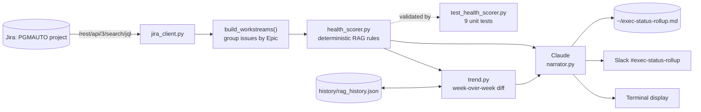

# Executive Status Rollup

<div align="center">

[](https://www.python.org/)
[](https://www.anthropic.com/)
[](https://developer.atlassian.com/)
[](test_health_scorer.py)

</div>

A weekly Red/Amber/Green executive rollup across a Jira portfolio — pulled
from real Jira data, scored by deterministic rules (not an LLM), narrated by
Claude, and tracked week-over-week so a status flip is visible instead of
silently overwritten.

**Why this exists:** the other two tools in this series
([slack-daily-agent](https://github.com/PlainJane20/slack-daily-brief),
[pm-automation-system](https://github.com/PlainJane20/pm-automation-system))
each solve one piece of a TPM's week — reading Slack, automating Jira
intake. This one is the integration: it's the artifact a TPM actually hands
to leadership, built by connecting the other two rather than starting a
fourth disconnected tool.

## At a glance

| | |
|---|---|
| **Problem** | Executive status reporting is usually a manual Friday-afternoon reconstruction across tickets, channels, and memory |
| **Approach** | Deterministic RAG scoring (auditable, testable) + Claude narration (grounded, not deciding status) + week-over-week trend diffing |
| **Data** | Real, live Jira data from the PGMAUTO project — not a mocked demo |
| **Stack** | Python · Jira REST API v3 · Claude (Anthropic API) · pytest · Slack API |

## Competencies demonstrated

| Competency | Observable evidence |
|---|---|
| Portfolio governance | Aggregates workstreams into a comparable executive health view |
| Decision-quality design | Deterministic status rules remain separate from narrative generation |
| Trend management | Week-over-week history makes deterioration and recovery visible |
| Systems integration | Connects Jira evidence, local history, Claude narration, and optional Slack delivery |
| Operational credibility | Documents real API migrations, timestamp defects, and credential propagation fixes |

## Architecture



## Key engineering decisions

| Decision | Why |
|---|---|
| RAG status is computed by rules, not by Claude | A status color is a fact about due dates and staleness, not a judgment call — asking an LLM to "decide" status invites the same invented-confidence failure mode an eval harness caught in a related project. Claude's role here is narrowly to write up already-computed facts. |
| Deterministic logic gets unit tests, not an eval harness | `health_scorer.py` has no model in the loop — there's nothing for an LLM judge to grade. `eval/`-style harnesses are for probabilistic output; plain `pytest` is the right tool here, and it's what actually caught a real bug (below). |
| Workstream matching by exact Jira key, not fuzzy text | A related project needed `difflib` fuzzy matching because Slack questions have no stable ID. Jira issues do — using an exact key match instead of fuzzy matching where the data supports it is simpler and has zero false-match risk. |
| Credentials resolved via a sibling-repo `.env` fallback chain | Reuses the same live Jira token already configured for `pm-automation-system` and the same Anthropic key already configured for `slack-daily-agent`, instead of asking for (and duplicating) the same secrets a third time. |

## Real bugs found building this

Same discipline as the other repos in this series — documented as found,
not smoothed over:

1. **The Jira Search API I built against doesn't exist anymore.** `/rest/api/3/search` returns HTTP 410 — Atlassian retired it. Found by testing against the real project instead of trusting older documentation; migrated to `/rest/api/3/search/jql` before writing another line against it.
2. **`datetime.fromisoformat` couldn't parse Jira's actual timestamps** on Python 3.9 — Jira returns offsets like `-0700` (no colon), which 3.9's parser rejects (3.11+ accepts it). Caught immediately by `test_health_scorer.py` — 8 of 9 tests failed on the first run — before this ever touched real data.
3. **A resolved credential silently didn't propagate.** `config.py`'s sibling-repo fallback resolves `ANTHROPIC_API_KEY` into a local dict, but `narrator.py` was reading `os.environ` directly — which the fallback never touches. Passing the key as an explicit function argument instead of an implicit environment read fixed the bug and removed the whole class of "which layer actually has this value" confusion.

## Setup

```bash
git clone <this repo>
cd exec-status-rollup
python3 -m venv venv
source venv/bin/activate
pip install -r requirements.txt
cp .env.example .env
# Fill in ANTHROPIC_API_KEY at minimum. JIRA_* falls back to
# ../pm-automation-system/.env automatically if you have that repo too.
```

## Usage

```bash
# Run once, save to ~/exec-status-rollup.md
python run_rollup.py

# Also post to a Slack channel
python run_rollup.py --slack-channel exec-status-rollup

# Run the unit tests
python -m pytest test_health_scorer.py -v
```

## Output example

```
# Executive Status Rollup — Tuesday, August 25, 2026

## 🔴 Red — Needs Attention
- Automated Inventory Reconciliation System (AIRS): No update in 26 days; only 1 of 2 child issues done.
- Automated Employee IT Onboarding Pipeline: No update in 68 days — longest stale gap in the portfolio.

## 🟡 Amber — Watch
- Customer Self Service Portal: No update in 68 days.

## 🟢 Green — On Track
None

## Summary
No workstreams are currently green — the portfolio is split between RED and
AMBER items, all driven by extended periods without updates...

---
Closed this period: test via JIRA
```

## Contact

<div align="center">

### **Navi Sohi**
*Technical Program Manager & Automation Engineer*

<br>

[](https://www.linkedin.com/in/navisohi/)
[](https://github.com/PlainJane20)
[](https://mail.google.com/mail/?view=cm&fs=1&to=nks.ai.dev@gmail.com)

<br>

</div>
